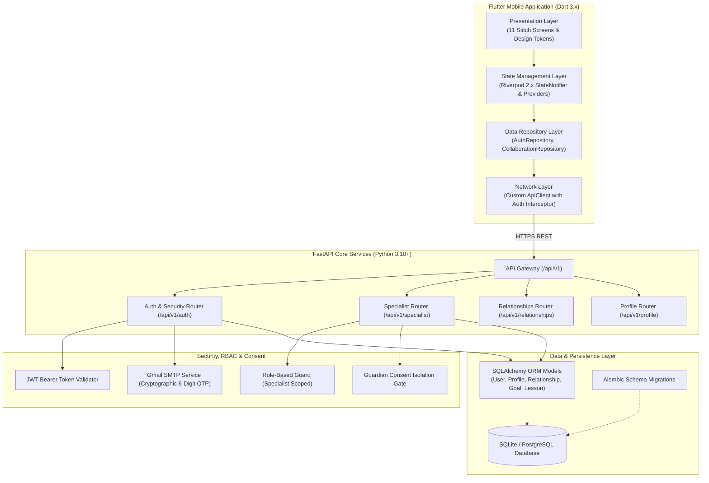

# LINGUA AI 🗣️🩺
### Evidence-Informed Clinical & Support Platform for Speech, Language & Literacy Specialists

[](https://flutter.dev)
[](https://fastapi.tiangolo.com)
[](https://python.org)
[](https://m3.material.io)
[](https://opensource.org/licenses/MIT)
[](https://github.com/DevanshKot09/Language)
[](https://flutter.dev)

---

## 📖 Table of Contents
1. [Platform Overview & Mission](#-platform-overview--mission)
2. [Clinical Grounding & Non-Diagnostic Notice](#-clinical-grounding--non-diagnostic-notice)
3. [The 11 Core Stitch-Designed Screens](#-the-11-core-stitch-designed-screens)
4. [Step-by-Step User Journey & Workflow](#-step-by-step-user-journey--workflow)
5. [System Architecture Diagram](#-system-architecture-diagram)
6. [Repository File & Directory Structure](#-repository-file--directory-structure)
7. [Comprehensive Backend API Reference](#-comprehensive-backend-api-reference)
8. [Step-by-Step Local Setup & Execution Guide](#-step-by-step-local-setup--execution-guide)
   - [Prerequisites](#prerequisites)
   - [Backend Setup (FastAPI & Database)](#backend-setup-fastapi--database)
   - [Mobile Setup (Flutter Application)](#mobile-setup-flutter-application)
9. [Automated Testing & Quality Verification](#-automated-testing--quality-verification)
10. [Data Privacy, Security & Guardian Consent Isolation](#-data-privacy-security--guardian-consent-isolation)
11. [License](#-license)

---

## 🌟 Platform Overview & Mission

**LINGUA AI** is an evidence-informed clinical coordination, guidance, and tele-practice platform engineered specifically for **Speech-Language Pathologists (SLPs)**, **Developmental Language Disorder (DLD) specialists**, and **Literacy/Dyslexia clinicians**.

Traditional speech and language support is hindered by clinical silos, fragmented communication between homes, schools, and therapy clinics, and the lack of real-time clinical oversight tools during remote consultation sessions. 

LINGUA AI bridges these gaps by providing:
- **Comprehensive Specialist Caseload & Milestone Tracking**: Unified dashboards tracking active learners, attendance, phonemic error markers, and practice frequency.
- **Stitch-Accurate Live Support Session Tele-practice**: Interactive 1-on-1 live session tools with an active speech cadence pacer, clinical notes drawer, session timers, and real-time exercise controls.
- **Multidisciplinary Support Circles**: Secure collaboration threads connecting Specialists, Parents, and Educators with guardian-consent security gates.
- **Human-in-the-Loop AI Oversight**: Clinician review mechanisms for automated recommendations before any learning modifications reach learners.

---

## ⚠️ Clinical Grounding & Non-Diagnostic Notice

> **IMPORTANT NON-DIAGNOSTIC NOTICE:**  
> LINGUA AI is an **educational support, practice monitoring, and clinical coordination tool**. It does **NOT** diagnose medical, neurological, or clinical disorders, nor does it generate formal diagnostic labels. All analytics, session summaries, and AI recommendations are designed to assist certified clinicians, speech-language pathologists (SLPs), educators, and parents. Formal clinical diagnoses must always be performed by licensed healthcare professionals and certified clinical speech-language evaluators.

---

## 📱 The 11 Core Stitch-Designed Screens

The LINGUA AI mobile client consists of 11 tightly integrated, Stitch-accurate screens:

```
┌─────────────────────────────────────────────────────────────────────────────┐
│                             AUTHENTICATION FLOW                             │
├─────────────────────┬─────────────────────┬─────────────────────────────────┤
│ 1. SplashScreen     │ 2. WelcomeScreen    │ 3. LoginScreen                  │
│    (/splash)        │    (/)              │    (/login)                     │
│    • Session check  │    • Entry portal   │    • Stitch visual hierarchy    │
│    • Auto-hydrate   │    • Get Started    │    • Email/password validation  │
├─────────────────────┴─────────────────────┼─────────────────────────────────┤
│ 4. SignupScreen (/signup)                 │ 5. ForgotPasswordScreen         │
│    • Specialist registration form         │    (/forgot-password)           │
│    • Role-scoped onboarding               │    • 6-digit cryptographic OTP  │
└───────────────────────────────────────────┴─────────────────────────────────┘
                                      │
                                      ▼
┌─────────────────────────────────────────────────────────────────────────────┐
│                        SPECIALIST WORKSPACE & CLINIC                        │
├───────────────────────────────────────────┬─────────────────────────────────┤
│ 6. SpecialistDashboardScreen (/specialist)│ 7. SpecialistLearnerDetailScreen│
│    • Caseload & Practice dual-tabs        │    (/specialist/learner)        │
│    • Key metrics (8 assigned, 24 audio)   │    • Learner switcher (Child/10)│
│    • Today's Schedule (Aarav M., Anaya P.)│    • 14-Day Streak & Engagement │
│    • Quick Tools (Caseload, Booking)      │    • 1-on-1 Live Session CTA    │
│    • AI Suggestions with Human Review     │    • Milestone Progress         │
│    • Bottom Nav (Home, Caseload, etc.)    │    • Latest Clinician Reflection│
├───────────────────────────────────────────┼─────────────────────────────────┤
│ 8. SpecialistScheduleScreen               │ 9. SpecialistMessagesScreen     │
│    (/specialist/schedule)                 │    (/specialist/messages)       │
│    • Day/Week clinical calendar           │    • Search & unread filtering  │
│    • Upcoming & completed appointments    │    • Pinned Aarav M. circle     │
│    • "Schedule Support Session" modal     │    • Consent pending lock state │
├───────────────────────────────────────────┼─────────────────────────────────┤
│ 10. CollaborationChatScreen               │ 11. SpecialistLiveSessionScreen │
│     (/collaboration/chat)                 │     (/specialist/live-session)  │
│     • Real-time message thread            │     • Live tele-practice UI     │
│     • Clinical resource attachments (PDF) │     • Speech Cadence Pacer      │
│     • Learner profile & schedule shortcut │     • Live session notes drawer │
│     • Guardian consent privacy banner     │     • Session completion recap  │
└───────────────────────────────────────────┴─────────────────────────────────┘
```

### Detailed Screen Breakdown

1. **`SplashScreen` (`/splash`)**: Initial launch gate that initializes secure storage, pre-caches design tokens, checks active session validity, and routes authenticated specialists directly to `/specialist`.
2. **`WelcomeScreen` (`/`)**: High-contrast, brand-aligned introductory landing screen allowing users to proceed to sign in or create an account.
3. **`LoginScreen` (`/login`)**: Full Stitch design featuring abstract brand artwork, email and password inputs, role-scoped credential validation, and password recovery routing.
4. **`SignupScreen` (`/signup`)**: Clean registration screen with input validation, role assignment, and direct post-auth routing into the Specialist workspace.
5. **`ForgotPasswordScreen` (`/forgot-password`)**: Multi-step recovery workflow validating user emails and generating 6-digit one-time password (OTP) verifications.
6. **`SpecialistDashboardScreen` (`/specialist`)**:
   - **Greeting Bar**: Displays current specialist credentials (e.g. Dr. Maya, SLP), notification modal, and profile bottom sheet.
   - **Metrics Hub**: Active caseload counter and daily audio turn logs.
   - **Today's Schedule Card**: Interactive cards showing scheduled patient sessions (e.g., Aarav M. at 10:30 AM, Anaya P. at 2:00 PM).
   - **Quick Tools**: Fast shortcuts to switch to Caseload view or trigger the session booking modal.
   - **AI Suggestions**: Human-in-the-loop review card for AI-suggested pacing exercises with Approve/Modify/Reject oversight.
   - **Caseload Tab**: Real-time search filter and learner cards with baseline status and track badges (DLD vs Dyslexia).
7. **`SpecialistLearnerDetailScreen` (`/specialist/learner`)**:
   - **Identity Card**: Age band, linked parent contact, practice streak, and clinical status.
   - **Learner Switcher**: Toggle seamlessly between child and adult patient dossiers.
   - **Action Grid**: Primary vibrant CTA for *Start Session* (tele-practice), *Schedule*, and *Guidance Chat*.
   - **Milestone Progress**: Visual progress bars across Phonemic Awareness, Reading Fluency & Pacing, and Syllable Segmentation.
   - **Latest Reflection**: Clinician quote box with clinical notes and date tracking.
8. **`SpecialistScheduleScreen` (`/specialist/schedule`)**: Day, week, and list view of upcoming consultations, session durations, and instant appointment booking modals.
9. **`SpecialistMessagesScreen` (`/specialist/messages`)**: Dedicated communications hub displaying team support circles. Unread count pills, pinned threads, and consent-gated lock notifications.
10. **`CollaborationChatScreen` (`/collaboration/chat`)**: Multi-stakeholder chat thread supporting text exchanges, file attachments (Phonics Pacing Cards, worksheets), message delivery states, and quick access to learner dossiers.
11. **`SpecialistLiveSessionScreen` (`/specialist/live-session`)**: Full-screen tele-practice interface matching Stitch specifications:
    - Learner identity and real-time session duration stopwatch.
    - Media controls: Microphone toggle, Camera toggle, Cadence Pacer, Clinical Notes drawer, and End Session.
    - Speech Cadence Pacer: Interactive tempo visualizer with adjustable beats-per-minute (BPM) to assist stuttering, cluttering, or rapid speech.
    - Post-session completion state: Duration recap, focus area summary, and clinical session notes logger.

---

## 🗺️ Step-by-Step User Journey & Workflow

```
[ Launch App ] 
      │
      ▼
[ Splash Screen ] ──(Has Valid Session?)──► [ Specialist Dashboard ]
      │ (No)                                         │
      ▼                                              │
[ Welcome Screen ]                                   │
      │                                              │
      ├───────────────────────┬──────────────────────┤
      ▼                       ▼                      │
[ Login Screen ]       [ Signup Screen ]             │
      │                       │                      │
      └───────────┬───────────┘                      │
                  ▼                                  │
    [ Authenticated Specialist ] ◄───────────────────┘
                  │
        ┌─────────┴────────────────────────┐
        ▼                                  ▼
[ Specialist Dashboard ]          [ Caseload Tab ]
        │                                  │
        ├──────────────────────┐           ▼
        ▼                      ▼     [ Learner Profile ]
[ Schedule Screen ]    [ Messages Hub ]    │ (Aarav M.)
        │                      │           ├─────────────────────┐
        │                      ▼           ▼                     ▼
        │             [ Chat Thread ]  [ Guidance Chat ] [ Start Live Session ]
        │                      │           │                     │
        └──────────────────────┴───────────┴─────────────────────▼
                                                    [ Live Tele-Practice ]
                                                    • Cadence Pacer
                                                    • Live Notes Drawer
                                                    • Session Completed Recap
```

### Typical Specialist Workflow
1. **Login & Overview**: Log in as a Speech-Language Specialist. The Dashboard immediately displays today's agenda, caseload alerts, and pending AI recommendations.
2. **Reviewing Caseload**: Tap the **Caseload** tab or search for a student (e.g., Aarav M.). Inspect their active track (Spoken Language - DLD), current 14-day practice streak, and linked parent contact.
3. **Clinical Consultation**: Open **Guidance Chat** with the student's multidisciplinary team (Parent Priya M. and Teacher Eleanor D.) to share pacing worksheets.
4. **Conducting a Live Session**: Launch **Start Session**. The app transitions to the **Live Support Session** interface. Use the integrated **Cadence Pacer** to guide verbal rhythm and log observations in the **Clinical Notes** modal.
5. **Session Wrap-Up**: Conclude the session to review the summary statistics (duration, focus area, and observation notes).

---

## 🏗️ System Architecture Diagram



---

## 📁 Repository File & Directory Structure

```
Lingual AI/
├── backend/                              # FastAPI Python Backend
│   ├── alembic/                          # Database schema migration scripts
│   ├── app/
│   │   ├── api/                          # API routing & endpoints
│   │   │   ├── deps.py                   # Dependency injection (Auth, DB, RBAC)
│   │   │   └── v1/
│   │   │       ├── endpoints/
│   │   │       │   ├── auth.py           # Registration, login, OTP verification
│   │   │       │   ├── profile.py        # Specialist & user profile endpoints
│   │   │       │   ├── relationships.py  # Collaborator invitations & acceptance
│   │   │       │   └── specialist.py     # Caseload, dossier, conversations, AI reviews
│   │   │       └── router.py             # Active API v1 endpoint aggregator
│   │   ├── core/                         # Configuration, JWT security, database
│   │   │   ├── config.py                 # Pydantic v2 application settings
│   │   │   ├── database.py               # SQLAlchemy database session & engine
│   │   │   ├── mail.py                   # SMTP mailer for OTP verification
│   │   │   └── security.py               # Password hashing & JWT token encoding
│   │   ├── models/                       # SQLAlchemy Database Models (Preserved)
│   │   │   ├── achievement.py            # Achievement metadata
│   │   │   ├── ai.py                     # AI recommendation records
│   │   │   ├── collaboration.py          # Relationships, invitations, conversations
│   │   │   ├── goal.py                   # Educational support goals
│   │   │   ├── learning.py               # Lessons & exercises schema
│   │   │   ├── profile.py                # User profiles & clinical focus
│   │   │   ├── skill.py                  # Standardized skill taxonomy
│   │   │   └── user.py                   # User entity & role definitions
│   │   ├── repositories/                 # Data access layer
│   │   │   ├── goal_repository.py        # Clinical goals data access
│   │   │   └── user_repository.py        # User & identity data access
│   │   ├── schemas/                      # Pydantic validation schemas
│   │   │   ├── auth.py                   # Auth requests & response models
│   │   │   ├── collaboration.py          # Caseload, conversation & chat schemas
│   │   │   └── user.py                   # User profile validation
│   │   ├── services/                     # Business logic services
│   │   │   ├── auth_service.py           # Registration, login & OTP flow
│   │   │   ├── collaboration_service.py  # Caseload authorization & messaging
│   │   │   └── profile_service.py        # Profile updates & retrieval
│   │   └── main.py                       # FastAPI application factory
│   ├── tests/                            # Backend Pytest test suite (18 tests)
│   └── requirements.txt                  # Python dependencies
│
├── mobile/                               # Flutter Mobile Client
│   ├── lib/
│   │   ├── app/
│   │   │   ├── providers/                # Session, storage, network providers
│   │   │   │   ├── auth_provider.dart    # Auth state bindings
│   │   │   │   ├── network_provider.dart # Dio / ApiClient bindings
│   │   │   │   └── session_provider.dart # User session state & logout logic
│   │   │   └── router/app_router.dart    # Route definitions & guards
│   │   ├── core/
│   │   │   ├── errors/                   # Unified failure & exception mapping
│   │   │   ├── network/                  # ApiClient, ApiEndpoints, error handlers
│   │   │   └── widgets/                  # LinguaButton, cards, custom headers
│   │   ├── features/
│   │   │   ├── authentication/           # LoginScreen, SignupScreen, ForgotPasswordScreen
│   │   │   ├── collaboration/            # Specialist Workspace & Clinic
│   │   │   │   ├── application/          # collaboration_providers.dart
│   │   │   │   ├── data/                 # collaboration_repository.dart
│   │   │   │   ├── domain/models/        # collaboration_models.dart
│   │   │   │   └── presentation/screens/
│   │   │   │       ├── specialist_dashboard_screen.dart
│   │   │   │       ├── specialist_learner_detail_screen.dart
│   │   │   │       ├── specialist_schedule_screen.dart
│   │   │   │       ├── specialist_messages_screen.dart
│   │   │   │       ├── collaboration_chat_screen.dart
│   │   │   │       └── specialist_live_session_screen.dart
│   │   │   └── welcome/                  # SplashScreen, WelcomeScreen
│   │   └── main.dart                     # Flutter entrypoint
│   ├── test/                             # Mobile test suite (126 tests)
│   └── pubspec.yaml                      # Lean Flutter dependencies (zero audio bloat)
│
└── shared/                               # Cross-cutting design tokens & models
```

---

## 📡 Comprehensive Backend API Reference

### 1. Authentication & Identity (`/api/v1/auth`)
| Method | Endpoint | Description | Auth Required |
|---|---|---|---|
| `POST` | `/api/v1/auth/signup` | Register a new user (with specialist role metadata) | No |
| `POST` | `/api/v1/auth/login` | Authenticate with email/password; returns JWT access token | No |
| `POST` | `/api/v1/auth/forgot-password` | Generate & dispatch 6-digit cryptographic OTP via Gmail SMTP | No |
| `POST` | `/api/v1/auth/verify-otp` | Validate submitted 6-digit OTP code | No |
| `POST` | `/api/v1/auth/reset-password` | Set new password using verified OTP token | No |
| `GET` | `/api/v1/auth/me` | Fetch active user credentials and verified role permissions | Yes |

### 2. Specialist Workspace & Tele-practice (`/api/v1/specialist`)
| Method | Endpoint | Description | Role Required |
|---|---|---|---|
| `GET` | `/api/v1/specialist` | List all verified specialists available for collaboration | Any Auth |
| `GET` | `/api/v1/specialist/caseload` | Retrieve active caseload learners, baseline status & risk metrics | `specialist` |
| `GET` | `/api/v1/specialist/learners/{id}` | Fetch clinical dossier, progress metrics & support goals | `specialist` |
| `POST` | `/api/v1/specialist/learners/{id}/goals` | Create a clinical learning-support goal for a learner | `specialist` |
| `GET` | `/api/v1/specialist/learners/{id}/ai-recommendations` | List pending AI recommendations for clinical oversight | `specialist` |
| `PUT` | `/api/v1/specialist/ai-recommendations/{id}` | Approve, modify, or reject AI-generated recommendations | `specialist` |
| `GET` | `/api/v1/specialist/conversations` | List support circles with unread counts and consent status | `specialist` |
| `GET` | `/api/v1/specialist/conversations/{id}/messages` | Fetch full message thread with attachments | `specialist` |
| `POST` | `/api/v1/specialist/conversations/{id}/messages` | Send guidance message into clinical conversation thread | `specialist` |

### 3. Relationships & Consent (`/api/v1/relationships`)
| Method | Endpoint | Description | Auth Required |
|---|---|---|---|
| `GET` | `/api/v1/relationships` | Retrieve active and pending relationships | Yes |
| `POST` | `/api/v1/relationships/invitations` | Issue collaboration invitation with permission scopes | Yes |
| `POST` | `/api/v1/relationships/invitations/accept` | Accept an invitation token to activate collaboration | Yes |
| `DELETE` | `/api/v1/relationships/{id}` | Revoke relationship and immediately terminate data access | Yes |

---

## 🛠️ Step-by-Step Local Setup & Execution Guide

### Prerequisites
- **Python**: 3.10 or higher
- **Flutter SDK**: 3.24 or higher
- **Git**
- **Gmail Account & App Password**: For OTP email verification

---

### Backend Setup (FastAPI & Database)

1. **Clone the repository:**
   ```bash
   git clone https://github.com/DevanshKot09/Language.git
   cd Language/backend
   ```

2. **Create and activate a virtual environment:**
   ```bash
   # Windows (PowerShell):
   python -m venv .venv
   .\.venv\Scripts\Activate.ps1

   # macOS / Linux:
   python3 -m venv .venv
   source .venv/bin/activate
   ```

3. **Install dependencies:**
   ```bash
   pip install --upgrade pip
   pip install -r requirements.txt
   ```

4. **Configure Environment Variables (`.env`):**
   Create a `.env` file in the `backend/` directory:
   ```env
   PROJECT_NAME="LINGUA AI"
   ENVIRONMENT="development"
   API_V1_STR="/api/v1"
   SECRET_KEY="your-jwt-secret-key-at-least-32-chars-long"
   ACCESS_TOKEN_EXPIRE_MINUTES=1440

   # Database
   DATABASE_URL="sqlite:///./lingua_ai.db"

   # Email Service (Gmail SMTP for 6-digit OTP delivery)
   SMTP_HOST="smtp.gmail.com"
   SMTP_PORT=587
   SMTP_TLS=True
   SMTP_USER="your-email@gmail.com"
   SMTP_PASSWORD="your-16-char-gmail-app-password"
   EMAIL_FROM="your-email@gmail.com"
   EMAIL_FROM_NAME="LINGUA AI Support"
   ```

5. **Run database migrations:**
   ```bash
   alembic upgrade head
   ```

6. **Start the FastAPI backend server:**
   ```bash
   uvicorn app.main:app --reload --host 0.0.0.0 --port 8000
   ```
   - Interactive Swagger API Documentation: [http://localhost:8000/docs](http://localhost:8000/docs)
   - Alternative ReDoc Documentation: [http://localhost:8000/redoc](http://localhost:8000/redoc)

---

### Mobile Setup (Flutter Application)

1. **Navigate to the mobile directory:**
   ```bash
   cd ../mobile
   ```

2. **Install Flutter packages:**
   ```bash
   flutter pub get
   ```

3. **Configure API Endpoint:**
   Ensure `lib/core/network/api_endpoints.dart` points to your active server:
   - **Android Emulator**: `http://10.0.2.2:8000/api/v1`
   - **Windows Desktop / Chrome / iOS Simulator**: `http://localhost:8000/api/v1`
   - **Physical Device**: `http://<YOUR_LOCAL_IP>:8000/api/v1`

4. **Run the Flutter Application:**
   ```bash
   # Run on connected device or simulator
   flutter run

   # Or target specific platforms
   flutter run -d windows       # Windows Desktop
   flutter run -d chrome        # Web Browser
   flutter run -d emulator-5554 # Android Emulator
   ```

---

## 🧪 Automated Testing & Quality Verification

The platform maintains automated test suites with 100% pass rates across both mobile and backend codebases:

### Backend Tests (Pytest)
```bash
cd backend
python -m pytest tests/
```
> **Result:** `18 passed in 20.71s` (100% passing)  
> Verifies JWT auth, password recovery OTP lifecycle, specialist caseload querying, AI recommendation human-review oversight, and guardian consent isolation.

### Mobile Tests (Flutter Test)
```bash
cd mobile
flutter test
```
> **Result:** `All tests passed! (126 tests passed)`  
> Validates Stitch-accurate widget hierarchies, responsive mobile layouts (320px, 360px, 390px, 430px), Riverpod state transitions, tele-practice controls, and navigation guards.

### Flutter Code Analysis
```bash
cd mobile
flutter analyze
```
> **Result:** `No issues found! (ran in 4.6s)` — 0 errors, 0 warnings, 0 lints.

---

## 🔒 Data Privacy, Security & Guardian Consent Isolation

1. **Guardian Consent Gating**:
   - For child learners, clinical conversations and profile access remain in a protected lock state until guardian consent is explicitly verified.
2. **Strict Server-Side RBAC**:
   - Specialist endpoints reject unauthorized roles with `403 Forbidden` errors.
   - Non-specialist attempts to access clinical interfaces cleanly trigger the "Return to Login" security fallback.
3. **Hardware Storage Isolation**:
   - Mobile authentication tokens are stored securely in hardware-backed storage (`flutter_secure_storage`).
   - Logging out immediately wipes local session tokens and resets Riverpod states.
4. **Lean Footprint & Permission Minimization**:
   - Unused audio recording packages and unnecessary microphone permissions have been removed from the mobile client manifests.

---

## 📄 License

This project is licensed under the **MIT License** — see the [LICENSE](LICENSE) file for full details.

---

**Developed with ❤️ for Speech-Language Pathologists, developmental clinicians, and learners worldwide.**
