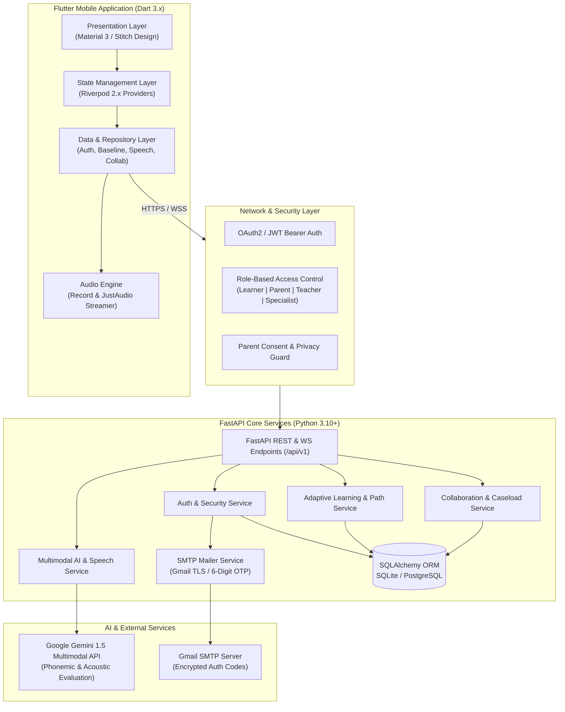

# LINGUA AI 🗣️📚
### Evidence-Informed Multimodal AI Speech, Language & Literacy Platform

[](https://flutter.dev)
[](https://fastapi.tiangolo.com)
[](https://python.org)
[](https://deepmind.google/technologies/gemini/)
[](https://m3.material.io)
[](https://opensource.org/licenses/MIT)
[](https://github.com/DevanshKot09/Language)

---

## 📖 Table of Contents
1. [Platform Overview & Mission](#-platform-overview--mission)
2. [Clinical Grounding & Non-Diagnostic Notice](#-clinical-grounding--non-diagnostic-notice)
3. [Core Pillars & Architectural Highlights](#-core-pillars--architectural-highlights)
4. [System Architecture Diagram](#-system-architecture-diagram)
5. [Deep Dive: How Everything Works](#-deep-dive-how-everything-works)
   - [Multimodal AI & Speech Engine](#1-multimodal-ai--speech-engine)
   - [Adaptive Dual-Track Learning Engine (DLD vs. Dyslexia)](#2-adaptive-dual-track-learning-engine-dld-vs-dyslexia)
   - [Role-Based Access Control & Security Architecture](#3-role-based-access-control--security-architecture)
   - [Cross-Role Collaboration & Consultation Engine](#4-cross-role-collaboration--consultation-engine)
6. [Comprehensive End-to-End User Journeys](#-comprehensive-end-to-end-user-journeys)
   - [Journey 1: First-Time Onboarding & Role Selection](#journey-1-first-time-onboarding--role-selection)
   - [Journey 2: Authentication & Password Recovery Flow](#journey-2-authentication--password-recovery-flow)
   - [Journey 3: Learner Experience (Screening to Mastery)](#journey-3-learner-experience-screening-to-mastery)
   - [Journey 4: Parent Experience & Home Monitoring](#journey-4-parent-experience--home-monitoring)
   - [Journey 5: Educator / Teacher Classroom Experience](#journey-5-educator--teacher-classroom-experience)
   - [Journey 6: Specialist / Speech-Language Pathologist (SLP) Experience](#journey-6-specialist--speech-language-pathologist-slp-experience)
7. [Repository File & Directory Structure](#-repository-file--directory-structure)
8. [Comprehensive API Reference](#-comprehensive-api-reference)
9. [Step-by-Step Local Setup & Execution Guide](#-step-by-step-local-setup--execution-guide)
   - [Prerequisites](#prerequisites)
   - [Backend Setup (FastAPI & Database)](#backend-setup-fastapi--database)
   - [Mobile Setup (Flutter Application)](#mobile-setup-flutter-application)
   - [Environment Configuration (.env)](#environment-configuration-env)
10. [Automated Testing & Verification](#-automated-testing--verification)
11. [Data Privacy, Security & Consent Isolation](#-data-privacy-security--consent-isolation)
12. [Roadmap & Contribution Guidelines](#-roadmap--contribution-guidelines)
13. [License](#-license)

---

## 🌟 Platform Overview & Mission

**LINGUA AI** is an advanced, evidence-informed speech, language, and literacy platform designed to address the critical developmental needs of individuals with **Developmental Language Disorder (DLD)** and **Dyslexia**. 

Children and learners navigating DLD and Dyslexia often face years of delays waiting for clinical evaluations ("wait-to-fail" paradigm). Traditional educational software frequently bundles all learning differences together, failing to distinguish between **oral language structural deficits** (DLD) and **phonological-orthographic decoding barriers** (Dyslexia).

LINGUA AI bridges this divide by delivering:
- **Tailored, condition-specific learning tracks** grounded in pedagogical research.
- **Real-time multimodal acoustic and phonemic evaluation** powered by Google Gemini AI.
- **A unified, four-role collaborative ecosystem** uniting Learners, Parents, Educators, and Speech-Language Specialists.

---

## ⚠️ Clinical Grounding & Non-Diagnostic Notice

> **IMPORTANT NON-DIAGNOSTIC NOTICE:**  
> LINGUA AI is an **educational support, practice, and skill-monitoring tool**. It does **NOT** diagnose medical, neurological, or clinical disorders, nor does it generate formal diagnostic labels. All screening metrics, pronunciation confidence scores, and recommendation reports are intended to inform educational interventions and support clinical speech-language pathologists (SLPs), educators, and parents. Formal diagnoses must always be performed by licensed healthcare professionals and certified clinicians.

---

## 💡 Core Pillars & Architectural Highlights

1. **Distinct DLD & Dyslexia Tracks:**
   - **DLD Track:** Concentrates on expressive/receptive syntax, morphology (tense markers, plurals), sentence formulation, vocabulary breadth, and narrative sequencing.
   - **Dyslexia Track:** Focuses on phonemic segmentation, grapheme-phoneme correspondences, orthographic mapping, decoding fluency, and multi-syllabic reading passages.
2. **Accessible, Stress-Free Design Language:**
   - Built strictly with typography suited for readers with dyslexia (**Lexend** and **Inter**).
   - Generous line spacing, high-contrast text, pastel background accents, and zero high-stimulus flickering.
   - Auditory prompts with calm, encouragement-driven micro-interactions.
3. **Multimodal AI Speech Feedback:**
   - High-fidelity microphone capture with real-time waveform visualization.
   - Acoustic confidence scoring and phoneme-level breakdown.
   - Non-judgmental, scaffolded hints generated on-the-fly via Google Gemini 1.5.
4. **Multi-Stakeholder Collaboration Hub:**
   - Separate, purposeful workflows for **Learners**, **Parents**, **Teachers**, and **Specialists**.
   - Real-time consultation chat threads, IEP goal alignment, classroom accommodation notes, and clinical caseload management.

---

## 🏗️ System Architecture Diagram



---

## 🔬 Deep Dive: How Everything Works

### 1. Multimodal AI & Speech Engine
- **Audio Capture & Streaming:** The client uses an audio recorder configured for mono 16kHz WAV/PCM audio streaming. The raw audio is pre-processed with noise suppression.
- **Waveform Visualizer:** During active recording, amplitude samples feed a reactive waveform widget, providing visual feedback to young or sensory-sensitive learners.
- **Phoneme Analysis:** The backend accepts base64 audio data and passes it through an acoustic analysis pipeline paired with Google Gemini multimodal inference.
- **Scaffolded AI Hints:** If a learner struggles with a word (e.g., omitting the `/s/` blend in "spoon"), the engine doesn't simply report a failure; it analyzes the specific phonemic omission and generates an encouraging, age-appropriate hint (e.g., *"Try holding out your snake sound 'ssss' before saying 'poon'!"*).

### 2. Adaptive Dual-Track Learning Engine (DLD vs. Dyslexia)
- **Taxonomy Mapping:** Every exercise is mapped to standardized skill taxonomy nodes:
  - *DLD Taxonomy:* `syntax_sentence_structure`, `morphology_inflections`, `vocabulary_expressive`, `narrative_sequencing`.
  - *Dyslexia Taxonomy:* `phonological_blending`, `orthographic_mapping`, `decoding_cvc`, `fluency_passage_reading`.
- **Mastery Locks:** Learners navigate an interactive node-based roadmap. Unlocking subsequent nodes requires demonstrating consistent accuracy (>80%) across multiple practice intervals.
- **Adaptive Difficulty:** If consecutive errors occur, the backend adjusts difficulty parameters dynamically without triggering learner frustration.

### 3. Role-Based Access Control & Security Architecture
- Users belong to one of four verified roles:
  - `learner`: Can complete exercises, take baseline screenings, earn badges, and practice speech.
  - `parent`: Can link child profiles, review daily activity, assign home practice, and message teachers/specialists.
  - `teacher`: Can monitor assigned classroom rosters, track IEP milestones, and review classroom accommodation strategies.
  - `specialist`: Can access assigned clinical caseloads, review detailed articulation analytics, create personalized clinical interventions, and engage in consultation threads.
- All tokens are signed with HMAC-SHA256 and stored using secure hardware storage (`flutter_secure_storage` on mobile).

### 4. Cross-Role Collaboration & Consultation Engine
- **Caseload Management:** Specialists can search and filter their caseload by risk level, condition track, or attendance.
- **Consultation Chat Threads:** Direct, isolated real-time messaging between Parents, Teachers, and Specialists. All messages are stamped with role tags to ensure clinical clarity.
- **Intervention Plan Approval:** Specialists can draft and push custom clinical exercises to a student's learning queue. Parents receive notification and can review the planned interventions.

---

## 🗺️ Comprehensive End-to-End User Journeys

```
                    ┌────────────────────────────┐
                    │  App Launch / Splash Screen │
                    └──────────────┬─────────────┘
                                   │
                                   ▼
                    ┌────────────────────────────┐
                    │ 3-Screen Onboarding Flow   │
                    │ (DLD & Dyslexia Overview)  │
                    └──────────────┬─────────────┘
                                   │
                                   ▼
                    ┌────────────────────────────┐
                    │ Role Selection & Portal    │
                    │ Learner | Parent | Teach | │
                    │ Specialist                 │
                    └──────────────┬─────────────┘
                                   │
         ┌─────────────────────────┴─────────────────────────┐
         ▼                                                   ▼
┌─────────────────────────┐                         ┌─────────────────────────┐
│     Create Account      │                         │  Welcome Back / Sign In │
│   (Role-Specific Meta)  │                         │ (Remember Me + OTP)     │
└────────────┬────────────┘                         └────────────┬────────────┘
             └─────────────────────────┬─────────────────────────┘
                                       │
                                       ▼
                       ┌──────────────────────────────┐
                       │ Authenticated Role Dashboard │
                       └──────────────┬───────────────┘
         ┌─────────────────┬──────────┴──────────┬──────────────────┐
         ▼                 ▼                     ▼                  ▼
┌─────────────────┐ ┌───────────────┐  ┌─────────────────┐ ┌────────────────┐
│ Learner Home    │ │ Parent Portal │  │ Teacher Portal  │ │ Specialist Hub │
│ • Baseline Quiz │ │ • Progress    │  │ • Class Roster  │ │ • Caseload     │
│ • Speech Lab    │ │ • Home Assign │  │ • IEP Tracking  │ │ • Articulation │
│ • Learning Path │ │ • SLP Chat    │  │ • Accommodation │ │ • Custom Plan  │
│ • Badges & XP   │ │ • Weekly Rpt  │  │ • Direct Notes  │ │ • Consult Chat │
└─────────────────┘ └───────────────┘  └─────────────────┘ └────────────────┘
```

### Journey 1: First-Time Onboarding & Role Selection
1. **Splash Screen:** Welcomes the user with a fluid animated logo, pre-caches design tokens, and checks for stored credentials.
2. **3-Screen Educational Onboarding:**
   - *Screen 1: Tailored Learning:* Introduces how LINGUA AI personalizes pathways for both DLD and Dyslexia.
   - *Screen 2: Speech & AI Feedback:* Highlights real-time speech evaluation with non-judgmental guidance.
   - *Screen 3: Unified Collaboration:* Demonstrates how learners, families, educators, and clinicians work together.
3. **Role Selection:** The user designates their role (`Learner`, `Parent`, `Teacher`, or `Specialist`).

### Journey 2: Authentication & Password Recovery Flow
1. **Sign Up:** User inputs Full Name, Email, Password, Age Group (for learners), and Role.
2. **Sign In ("Welcome Back"):**
   - Clean, modern layout designed according to Stitch specifications.
   - Quick-toggle for password visibility and "Remember Me" checkbox for token persistence.
3. **Forgot Password with Gmail SMTP Integration:**
   - User enters registered email.
   - The backend validates the user and dispatches an authentic 6-digit cryptographic OTP via Gmail SMTP TLS.
   - User inputs the 6-digit OTP on a dedicated code-entry screen.
   - Upon verification, the user securely resets their password.

### Journey 3: Learner Experience (Screening to Mastery)
1. **Baseline Screening (Day 1):**
   - Takes a 5-10 minute age-adaptive questionnaire and listening task.
   - Measures expressive vocabulary, phonological awareness, and syntax formulation.
   - Assigns a recommended starting track (`DLD`, `Dyslexia`, or `Combined Support`).
2. **Daily Practice Dashboard:**
   - Displays daily streak counter, active goals (e.g., "Complete 2 phonics modules"), and current XP.
3. **Interactive Speech Lab:**
   - Prompts the learner with an auditory target word or sentence.
   - Learner taps the microphone button; live audio waves react to their voice.
   - AI evaluates the pronunciation, highlights correct phonemes, and offers scaffolding hints.
4. **Mastery & Celebrations:**
   - Earning mastery points unlocks themed badges, milestones, and new difficulty tiers.

### Journey 4: Parent Experience & Home Monitoring
1. **Overview Dashboard:** View linked children, daily practice time, and current skill mastery.
2. **Weekly Progress Insights:** Bar graphs showing phoneme accuracy trends and vocabulary expansion over time.
3. **Home Practice Assignment:** Parents can trigger 10-minute targeted home sessions recommended by the specialist.
4. **Direct Messaging:** Direct, secure chat thread with the child's teacher and speech therapist.

### Journey 5: Educator / Teacher Classroom Experience
1. **Class Roster:** Overview of all students requiring speech or literacy accommodations.
2. **Accommodation Guide:** Practical classroom recommendations (e.g., using visual timers, breaking multi-step spoken instructions into chunks, dyslexia-friendly fonts on printouts).
3. **IEP Target Alignment:** Track progress against official educational targets and log observations.
4. **Collaborative Notes:** Share updates with the specialist before parent-teacher conferences.

### Journey 6: Specialist / Speech-Language Pathologist (SLP) Experience
1. **Caseload Management:** Real-time roster sorted by urgency, track, and adherence.
2. **Phoneme & Speech Articulation Analytics:** Deep analytics showing specific phoneme substitutions (e.g., `/r/` gliding or final consonant deletion).
3. **Custom Intervention Plans:** Review AI-generated intervention recommendations, modify exercise parameters, and push updates directly to the learner's app.
4. **Direct Consultations:** Conduct text-based consultation threads with parents and teachers.

---

## 📁 Repository File & Directory Structure

```
Lingual AI/
├── backend/                              # FastAPI Async Python Backend
│   ├── alembic/                          # Database schema migration scripts
│   ├── app/
│   │   ├── ai/                           # Gemini AI integration, audio decoders, prompt templates
│   │   │   ├── gemini_client.py          # Gemini API wrapper with rate-limiting & fallback
│   │   │   ├── prompt_templates.py       # Clinical scaffolding prompts
│   │   │   └── speech_analyzer.py        # Phoneme & acoustic analysis engine
│   │   ├── api/v1/endpoints/             # REST API routes
│   │   │   ├── auth.py                   # Sign-up, sign-in, OTP verification, password reset
│   │   │   ├── baseline.py               # Baseline screening assessment endpoints
│   │   │   ├── learning.py               # Exercises, tracks, taxonomy, mastery nodes
│   │   │   ├── speech.py                 # Audio upload, live speech assessment
│   │   │   ├── specialist.py             # Specialist caseload, clinical interventions, chat
│   │   │   ├── teacher.py                # Teacher classroom roster, accommodations, IEPs
│   │   │   ├── parent.py                 # Parent dashboard, child progress, assignments
│   │   │   ├── progress.py               # Analytics, streaks, achievements, goals
│   │   │   └── ai.py                     # AI recommendation endpoints & safety guardrails
│   │   ├── core/                         # Configuration, JWT security, email service
│   │   │   ├── config.py                 # Pydantic BaseSettings (.env loading)
│   │   │   ├── security.py               # Password hashing (Argon2 / BCrypt), JWT tokens
│   │   │   ├── mail.py                   # SMTP mail sender with TLS & HTML email templates
│   │   │   └── database.py               # SQLAlchemy async engine & sessionmaker
│   │   ├── models/                       # SQLAlchemy Database Models
│   │   │   ├── user.py                   # User entity & role definitions
│   │   │   ├── baseline.py               # Screening submissions & snapshots
│   │   │   ├── exercise.py               # Learning exercises & curriculum nodes
│   │   │   ├── speech_attempt.py         # Audio submissions & phonemic evaluation logs
│   │   │   ├── collaboration.py          # Caseload links, chat threads, IEP goals
│   │   │   └── progress.py               # Streaks, badges, goal records
│   │   ├── repositories/                 # Data access layer for database queries
│   │   ├── schemas/                      # Pydantic validation schemas
│   │   └── services/                     # Business logic layer
│   │       ├── auth_service.py           # Registration, authentication, OTP lifecycle
│   │       ├── baseline_service.py       # Adaptive questionnaire evaluation
│   │       ├── collaboration_service.py  # Caseload, role isolation, message routing
│   │       └── speech_service.py         # Audio processing & AI evaluation pipeline
│   ├── tests/                            # Comprehensive Pytest test suite (96 tests)
│   └── requirements.txt                  # Python dependencies
│
├── mobile/                               # Cross-Platform Flutter Client
│   ├── lib/
│   │   ├── app/
│   │   │   └── router/app_router.dart    # GoRouter configuration & route guards
│   │   ├── core/
│   │   │   ├── network/                  # Dio HTTP client, auth interceptor, endpoints
│   │   │   ├── theme/                    # Material 3 theme, Lexend typography, color palettes
│   │   │   └── widgets/                  # Reusable accessible buttons, cards, waveforms
│   │   ├── features/
│   │   │   ├── welcome/                  # Animated splash screen
│   │   │   ├── onboarding/               # 3-Screen interactive onboarding tour
│   │   │   ├── role_selection/           # Role picker (Learner, Parent, Teacher, Specialist)
│   │   │   ├── authentication/           # Login, Signup, Forgot Password, OTP verification
│   │   │   ├── baseline/                 # Screening questionnaire & skill snapshot screens
│   │   │   ├── learner_home/             # Daily learner hub, streak banner, quick practice
│   │   │   ├── learning/                 # Dynamic exercise player & audio player
│   │   │   ├── learning_path/            # Visual mastery node roadmap
│   │   │   ├── speech/                   # Speech lab, microphone recorder, phoneme feedback
│   │   │   ├── progress/                 # Analytics charts, goal manager, badge showcase
│   │   │   ├── collaboration/            # Specialist, Teacher, Parent dashboards & chat
│   │   │   │   ├── presentation/screens/
│   │   │   │   │   ├── specialist_dashboard_screen.dart
│   │   │   │   │   ├── specialist_messages_screen.dart
│   │   │   │   │   ├── collaboration_chat_screen.dart
│   │   │   │   │   ├── teacher_dashboard_screen.dart
│   │   │   │   │   └── parent_dashboard_screen.dart
│   │   │   │   ├── data/collaboration_repository.dart
│   │   │   │   └── domain/models/collaboration_models.dart
│   │   │   └── settings/                 # Accessibility settings, audio sensitivity
│   │   └── main.dart                     # Flutter application entrypoint
│   ├── test/                             # Flutter Unit & Widget tests (222 tests)
│   └── pubspec.yaml                      # Flutter dependencies & asset declarations
│
├── shared/                               # Common Taxonomy & Design Assets
│   ├── architecture/                     # Clinical skill taxonomies & safety boundary docs
│   └── design_tokens/                    # Standardized color hexes, typography scales, radii
│
└── brain/                                # Research documentation & architectural ADRs
```

---

## 📡 Comprehensive API Reference

### 1. Authentication & Identity (`/api/v1/auth`)
| Method | Endpoint | Description | Auth Required |
|---|---|---|---|
| `POST` | `/api/v1/auth/signup` | Register a new user with role and metadata | No |
| `POST` | `/api/v1/auth/login` | Authenticate with email/password; returns JWT | No |
| `POST` | `/api/v1/auth/forgot-password` | Generate & send 6-digit OTP via Gmail SMTP | No |
| `POST` | `/api/v1/auth/verify-otp` | Validate 6-digit email OTP | No |
| `POST` | `/api/v1/auth/reset-password` | Set new password using verified OTP token | No |
| `GET` | `/api/v1/auth/me` | Fetch authenticated user profile & permissions | Yes |

### 2. Baseline Screening (`/api/v1/baseline`)
| Method | Endpoint | Description | Auth Required |
|---|---|---|---|
| `GET` | `/api/v1/baseline/questions` | Get age-adaptive screening questions | Yes |
| `POST` | `/api/v1/baseline/submit` | Submit screening responses and get track assignment | Yes |
| `GET` | `/api/v1/baseline/summary/{id}` | Retrieve skill snapshot and performance metrics | Yes |

### 3. Learning & Adaptive Curriculum (`/api/v1/learning`)
| Method | Endpoint | Description | Auth Required |
|---|---|---|---|
| `GET` | `/api/v1/learning/tracks` | List available tracks (`dld`, `dyslexia`) | Yes |
| `GET` | `/api/v1/learning/path/{track_id}` | Fetch node-based progression roadmap | Yes |
| `GET` | `/api/v1/learning/exercise/{id}` | Fetch exercise content, targets, and media | Yes |
| `POST` | `/api/v1/learning/exercise/submit` | Submit exercise answers and update mastery score | Yes |

### 4. Multimodal Speech & AI Assessment (`/api/v1/ai` & `/api/v1/speech`)
| Method | Endpoint | Description | Auth Required |
|---|---|---|---|
| `POST` | `/api/v1/speech/evaluate` | Upload audio waveform; returns phoneme score & hints | Yes |
| `POST` | `/api/v1/ai/scaffold-hint` | Request an adaptive hint based on prior mistakes | Yes |
| `GET` | `/api/v1/ai/recommendations` | Get personalized exercise recommendations | Yes |

### 5. Multi-Stakeholder Collaboration (`/api/v1/specialist`, `/api/v1/teacher`, `/api/v1/parent`)
| Method | Endpoint | Description | Role Required |
|---|---|---|---|
| `GET` | `/api/v1/specialist/caseload` | List assigned learners, status, and condition | `specialist` |
| `GET` | `/api/v1/specialist/caseload/{id}/analytics` | Detailed phonemic articulation error metrics | `specialist` |
| `POST` | `/api/v1/specialist/interventions/assign` | Push custom clinical exercises to learner | `specialist` |
| `GET` | `/api/v1/specialist/conversations` | List consultation chat threads | `specialist` |
| `POST` | `/api/v1/specialist/conversations/{id}/messages` | Send message in consultation chat | `specialist` |
| `GET` | `/api/v1/teacher/classroom-roster` | List students with classroom accommodations | `teacher` |
| `POST` | `/api/v1/teacher/iep-goals/update` | Update status of IEP goal milestones | `teacher` |
| `GET` | `/api/v1/parent/child-summary` | Retrieve child daily progress, goals, and streaks | `parent` |

---

## 🛠️ Step-by-Step Local Setup & Execution Guide

### Prerequisites
- **Python:** 3.10 or higher
- **Flutter SDK:** 3.24 or higher
- **Git**
- **Google Gemini API Key:** Obtain from [Google AI Studio](https://aistudio.google.com/)
- **Gmail Account & App Password:** For testing automated OTP email verification

---

### Backend Setup (FastAPI & Database)

1. **Clone the repository:**
   ```bash
   git clone https://github.com/DevanshKot09/Language.git
   cd Language/backend
   ```

2. **Create and activate a virtual environment:**
   ```bash
   # Windows (PowerShell):
   python -m venv .venv
   .\.venv\Scripts\Activate.ps1

   # macOS / Linux:
   python3 -m venv .venv
   source .venv/bin/activate
   ```

3. **Install dependencies:**
   ```bash
   pip install --upgrade pip
   pip install -r requirements.txt
   ```

4. **Configure Environment Variables:**
   Create a `.env` file in the `backend/` directory:
   ```env
   PROJECT_NAME="LINGUA AI"
   ENVIRONMENT="development"
   API_V1_STR="/api/v1"
   SECRET_KEY="your-super-secret-jwt-signing-key"
   ACCESS_TOKEN_EXPIRE_MINUTES=1440

   # Database
   DATABASE_URL="sqlite+aiosqlite:///./lingua_ai.db"

   # Google Gemini AI
   GEMINI_API_KEY="your-gemini-api-key-here"

   # Email Service (Gmail SMTP for 6-Digit OTP Delivery)
   SMTP_HOST="smtp.gmail.com"
   SMTP_PORT=587
   SMTP_TLS=True
   SMTP_USER="your-email@gmail.com"
   SMTP_PASSWORD="your-16-char-gmail-app-password"
   EMAIL_FROM="your-email@gmail.com"
   EMAIL_FROM_NAME="LINGUA AI Support"
   ```

5. **Run Database Migrations:**
   ```bash
   alembic upgrade head
   ```

6. **Start the FastAPI Server:**
   ```bash
   uvicorn app.main:app --reload --host 0.0.0.0 --port 8000
   ```
   - Interactive Swagger API Documentation: [http://localhost:8000/docs](http://localhost:8000/docs)
   - Alternative ReDoc Documentation: [http://localhost:8000/redoc](http://localhost:8000/redoc)

---

### Mobile Setup (Flutter Application)

1. **Navigate to the mobile directory:**
   ```bash
   cd ../mobile
   ```

2. **Install Flutter packages:**
   ```bash
   flutter pub get
   ```

3. **Configure API Endpoints:**
   - In `lib/core/network/api_endpoints.dart`, set `baseUrl`:
     - **Android Emulator:** `http://10.0.2.2:8000/api/v1`
     - **iOS Simulator / Desktop / Web:** `http://localhost:8000/api/v1`
     - **Physical Device:** `http://<YOUR_LOCAL_IP>:8000/api/v1`

4. **Run the Application:**
   ```bash
   # Run on connected device or simulator
   flutter run

   # Or specify target
   flutter run -d chrome        # Web
   flutter run -d windows       # Windows Desktop
   flutter run -d emulator-5554 # Android Emulator
   ```

---

## 🧪 Automated Testing & Verification

The project is backed by comprehensive, multi-layer automated test suites across both backend and mobile codebases.

### Running Backend Tests (Pytest)
```bash
cd backend
pytest
```
> **Current Status:** `96 passed, 0 failed`  
> Verifies JWT auth, OTP password reset lifecycle, baseline screening logic, Gemini AI integration, audio analysis, RBAC permissions, and collaboration APIs.

### Running Mobile Tests (Flutter Test)
```bash
cd mobile
flutter test
```
> **Current Status:** `222 passed, 0 failed`  
> Verifies UI widget hierarchies, responsive viewports (320px to 430px), Stitch-designed Specialist and Auth screens, Riverpod state updates, audio recorder interactions, and navigation routes.

---

## 🔒 Data Privacy, Security & Consent Isolation

1. **FERPA & COPPA Principles:**
   - No biometric voice data is stored without explicit parental consent.
   - Learner profiles are protected and accessible only to linked parents, verified teachers, and licensed specialists.
2. **Consent-Gated Collaboration:**
   - Specialists and educators can only access student records after a parent explicitly approves the connection request.
3. **Encrypted In-Transit & At-Rest:**
   - Audio transmissions use HTTPS/WSS encryption.
   - User credentials, session tokens, and passwords utilize modern hashing (Argon2 / BCrypt).
4. **Strict Sanitization:**
   - The `.gitignore` strictly ignores local databases, cache files, and private `.env` credential files.

---

## 🚀 Roadmap & Contribution Guidelines

- [x] Baseline adaptive screening questionnaire & skill snapshots.
- [x] Dual-track curriculum engine (DLD vs Dyslexia).
- [x] Real-time audio waveform visualizer & Gemini AI speech assessment.
- [x] 6-digit OTP email verification via Gmail SMTP.
- [x] Specialist caseload management, articulation analytics & consultation threads.
- [x] Teacher classroom roster, accommodations & IEP goal tracking.
- [ ] Offline-first exercise caching via Hive / SQLite.
- [ ] Multilingual phonemic assessment (Spanish, Hindi, French).
- [ ] Web Speech API real-time fallback for pure web clients.

### How to Contribute
1. Fork the repository.
2. Create a feature branch (`git checkout -b feat/amazing-feature`).
3. Commit your changes (`git commit -m 'feat: add amazing feature'`).
4. Ensure all backend and mobile tests pass (`pytest` & `flutter test`).
5. Push to your branch (`git push origin feat/amazing-feature`).
6. Open a Pull Request.

---

## 📄 License

This project is licensed under the **MIT License** — see the [LICENSE](LICENSE) file for full details.

---

**Developed with ❤️ for learners, families, educators, and clinicians worldwide.**
